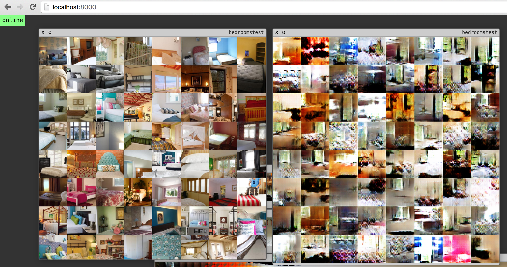

DCGAN.torch: Train your own image generator
===========================================================

1. [Train your own network](#1-train-your-own-network)
   1. [Train a face generator using the Celeb-A dataset](#11-train-a-face-generator-using-the-celeb-a-dataset)
   2. [Train Bedrooms, Bridges, Churches etc. using the LSUN dataset](#12-train-bedrooms-bridges-churches-etc-using-the-lsun-dataset)
   3. [Train a generator on your own set of images.](#13-train-a-generator-on-your-own-set-of-images)
   4. [Train on the ImageNet dataset](#14-train-on-the-imagenet-dataset)
2. [Use a pre-trained generator to generate images.]()
   1. Generate samples of 64x64 pixels
   2. Generate large artsy images (tried up to 4096 x 4096 pixels)
   3. Walk in the space of samples

# Prerequisites
- Computer with Linux or OSX
- Torch-7
- For training, an NVIDIA GPU is strongly recommended for speed. CPU is supported but training is very slow.

# Installing dependencies
## Without GPU
- Install Torch:  http://torch.ch/docs/getting-started.html#_


## With NVIDIA GPU
- Install CUDA, and preferably CuDNN (optional).
  - Instructions for Ubuntu are here: [INSTALL.md](INSTALL.md)
- Install Torch:  http://torch.ch/docs/getting-started.html#_

## Display UI
Optionally, for displaying images during training and generation, we will use the [display package](https://github.com/szym/display).

- Install it with: `luarocks install display`
- Then start the server with: `th -ldisplay.start`
- Open this URL in your browser: [http://localhost:8000](http://localhost:8000)

You can see training progress in your browser window. It will look something like this:



# 1. Train your own network

## 1.1 Train a face generator using the Celeb-A dataset
### Preprocessing

```bash
mkdir celebA; cd celebA
```

Download img_align_celeba.zip from [http://mmlab.ie.cuhk.edu.hk/projects/CelebA.html](http://mmlab.ie.cuhk.edu.hk/projects/CelebA.html) under the link "Align&Cropped Images".

```bash
unzip img_align_celeba.zip; cd ..
DATA_ROOT=celebA th data/crop_celebA.lua
```

### Training

```bash
DATA_ROOT=celebA dataset=folder th main.lua
```

## 1.2. Train Bedrooms, Bridges, Churches etc. using the LSUN dataset

LSUN dataset is shipped as an LMDB database. First, install LMDB on your system.

- On OSX with Homebrew:  `brew install lmdb`
- On Ubuntu: `sudo apt-get install liblmdb-dev`

Then install a couple of Torch packages.

```bash
luarocks install lmdb.torch
luarocks install tds
```

### Preprocessing (with bedroom class as an example)
Download `bedroom_train_lmdb` from the [LSUN website](http://lsun.cs.princeton.edu).

Generate an index file:
```bash
DATA_ROOT=[path_to_lmdb] th data/lsun_index_generator.lua
```

### Training
```bash
DATA_ROOT=[path-to-lmdb] dataset=lsun cuth main.lua
```

## 1.3. Train a generator on your own set of images.
### Preprocessing
- Create a folder called `myimages`.
- Inside that folder, create a folder called `images` and place all your images inside it.

### Training
```bash
DATA_ROOT=myimages dataset=folder th main.lua
```

## 1.4. Train on the ImageNet dataset

### Preprocessing
[Follow instructions from this link.](https://github.com/soumith/imagenet-multiGPU.torch#data-processing)

### Training
```bash
DATA_ROOT=[PATH_TO_IMAGENET]/train dataset=folder th main.lua
```


# 2. Use a pre-trained generator to generate images.

##2.1. Generate samples of 64x64 pixels
##2.2. Generate large artsy images (tried up to 4096 x 4096 pixels)
##2.3. Walk in the space of samples
